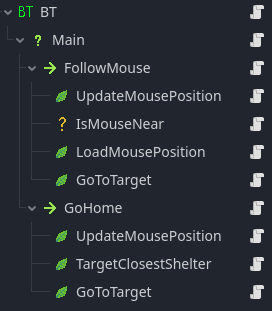

# Godot 4.2 C# Behavior Tree

This repository contains the code for the plugin enabling the implementation of a behavior tree to design AIs in Godot 4.2.

It is a basic implementation that would require improvements.

## Functionality

The plugin adds new nodes to the editor (search for "BehaviourTree" when adding a node).

The BT node should be placed at the base of the behavior tree, the rest depends on the logic you want to implement.

There are different types of nodes to design behavior:
- Composite nodes that define the execution logic of child nodes
- Decorator nodes that alter the behavior of their child node
- Conditions used for checks without altering any state
- Leaf nodes that represent the end of a branch, they execute the AI's actions

It is interesting to use the blackboard provided in function calls to transfer and alter variables between different Leafs and Conditions. This approach allows for designing independent nodes that can be reused for multiple behavior trees.

## Demonstrations

The scene 'Demo1' implements a very simple behavior tree. The AI tries to reach the mouse within a certain radius. If the mouse is too far, the AI returns to its shelter.

# Assets made by [Cupnooble](https://cupnooble.itch.io/)